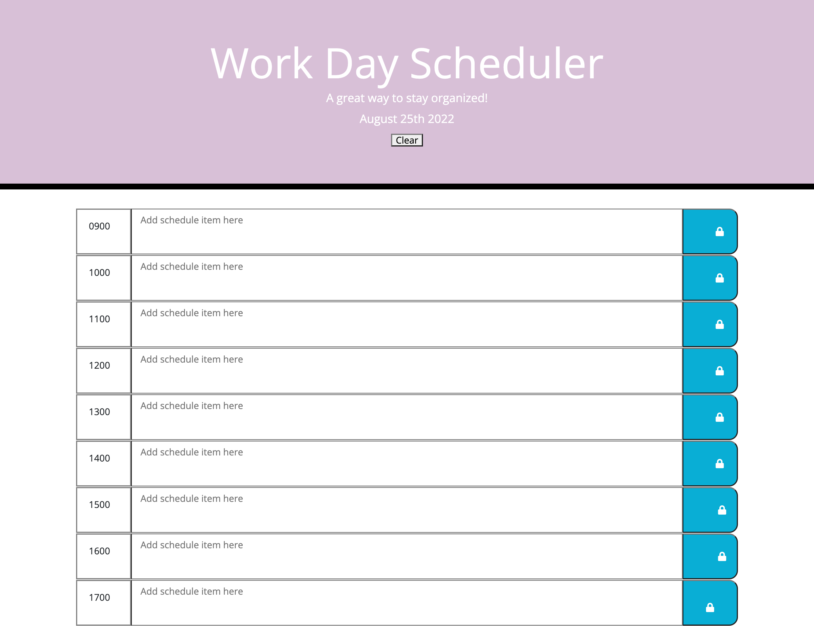

# work-day-scheduler-project
05-third-Party-APIs
## Table of Contents
1. [Description](#Description)
2. [Visuals](#visuals)

## Description
This project is an app that allows the user to plan their day by the hourly block from 9am-5pm. The user can save text and also clear the text when needed. 
[Link to live site](https://brandym98.github.io/work-day-scheduler-project/)

## Visuals

